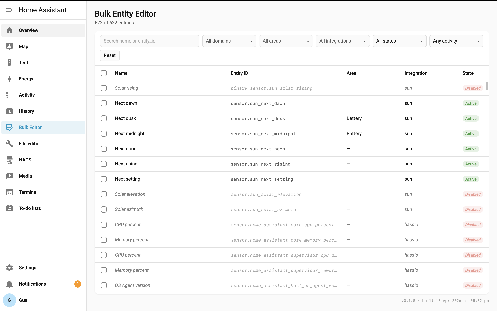
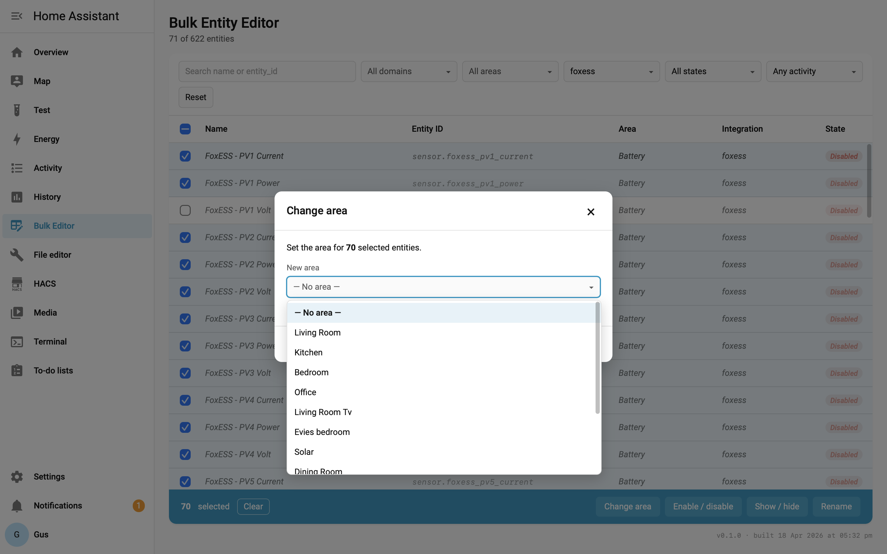
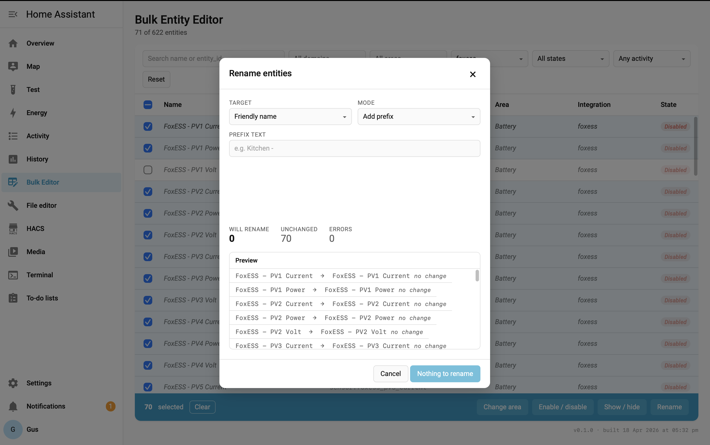

# Bulk Entity Editor for Home Assistant

[](https://hacs.xyz)
[](https://github.com/delgusto/ha-bulk-entity-editor/actions/workflows/validate.yml)
[](https://github.com/delgusto/ha-bulk-entity-editor/releases)

A Home Assistant custom integration that adds a **Bulk Editor** panel to your sidebar for multi-selecting entities and applying changes in one action — instead of clicking into each entity one at a time.



## Features

- **Filter** by name/entity_id search, domain, area, integration, and state (active / disabled / hidden).
- **Multi-select** with sticky selection across filter changes — filter, select, re-filter, select more, apply to the union.
- **Bulk actions:**
  - **Change area** — including "No area".
  - **Enable / disable** entities (`disabled_by`).
  - **Show / hide** entities (`hidden_by`).
  - **Rename** — friendly names or entity IDs, with prefix / suffix / find-replace (plain or regex) modes. Live preview, collision detection, and a clear warning before you rename IDs that your automations might reference.
- **Progress + retry** — runs up to 8 updates in parallel with a progress bar, shows a per-entity results list on finish, and lets you retry just the failures.
- **Live updates** — subscribes to entity / area / device registry events so the table reflects changes made elsewhere in HA in near real time.
- **Virtualized table** — handles thousands of entities without lag.
- **Admin-only** access.

## Install

### Via HACS (recommended once the integration is in the HACS default store)

1. HACS → Integrations → search **Bulk Entity Editor** → Install.
2. Restart Home Assistant.
3. Settings → Devices & Services → **Add Integration** → "Bulk Entity Editor".
4. Open **Bulk Editor** in the sidebar.

### Via HACS as a custom repository (before default-store listing)

1. HACS → Integrations → ⋮ → **Custom repositories**.
2. Add `https://github.com/delgusto/ha-bulk-entity-editor` with category **Integration**.
3. Install from HACS, then continue from step 2 above.

### Manual

1. Copy `custom_components/bulk_entity_editor/` into your HA config's `custom_components/` folder. The `frontend/bulk-entity-editor.js` bundle ships in the repo — you don't need to build it.
2. Restart Home Assistant.
3. Settings → Devices & Services → **Add Integration** → "Bulk Entity Editor".

## Screenshots

| Change area | Rename with preview |
|---|---|
|  |  |

## Usage

1. Click **Bulk Editor** in the sidebar.
2. Use the filter bar to narrow the list.
3. Click rows (or the header checkbox) to build a selection.
4. When one or more entities are selected, an action bar appears at the bottom — pick an action, configure it in the dialog, and apply.
5. After the run completes, a results dialog shows successes and failures. Use **Retry failed** if anything needs another pass.

### A note on renaming entity IDs

Renaming friendly names is always safe. Renaming **entity IDs** is not — Home Assistant does not auto-update automations, scripts, dashboards, or templates that reference the old ID. You'll see a red warning banner in the rename dialog when you switch to this target. Use it, but check your automations afterward.

## Compatibility

- Home Assistant **2026.3.0** or later (required for the in-repo brand assets HA introduced in that release).
- All frontends supported by HA (desktop browser, HA companion app, etc.). No Home Assistant Cloud required.
- Works with both HAOS / Supervised and Container / Core installs.

## Development

The Python side has zero runtime dependencies beyond Home Assistant. The frontend is a Lit + TypeScript web component built with Vite.

```bash
cd frontend-src
npm install
npm run dev        # rebuilds on save into custom_components/bulk_entity_editor/frontend/
npm test           # Vitest — unit tests for the rename library
npm run typecheck  # tsc --noEmit
npm run build      # production bundle
```

For hot iteration against a running HA instance, symlink `custom_components/bulk_entity_editor/` into your HA config's `custom_components/` folder so rebuilds are picked up on a browser refresh (Python changes still require an HA restart).

### Project layout

```
custom_components/bulk_entity_editor/   # Python integration + shipped bundle
frontend-src/                           # Lit + Vite source (not shipped)
.github/workflows/validate.yml          # HACS + hassfest + frontend CI
hacs.json                               # HACS metadata
```

## Known limitations

- Labels, entity category, and icon changes are not yet wired up as bulk actions. Open to adding them if anyone asks.
- "Retry failed" replays the exact same update. If the original action depended on the entity being in a specific state (e.g. "Disable" skips already-disabled entities), retried items may no-op.
- Undo is not implemented. Home Assistant itself doesn't have an undo primitive for registry changes — use find/replace or a second bulk action to revert.

## Contributing

Bug reports and feature requests welcome — please use the issue templates in this repo. PRs welcome too; keep the Python side minimal and the frontend in Lit/vanilla TS (no heavy UI frameworks).

## License

[MIT](LICENSE)
